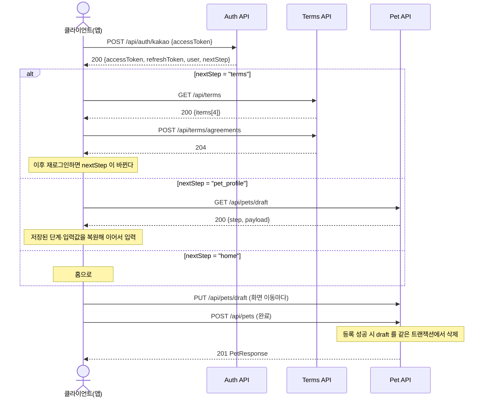
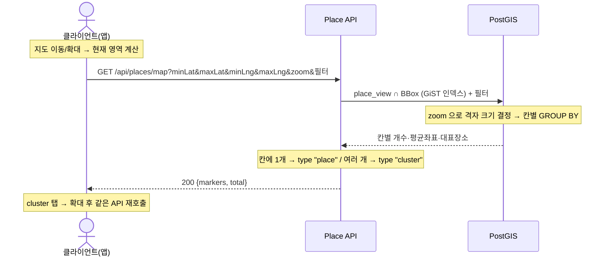
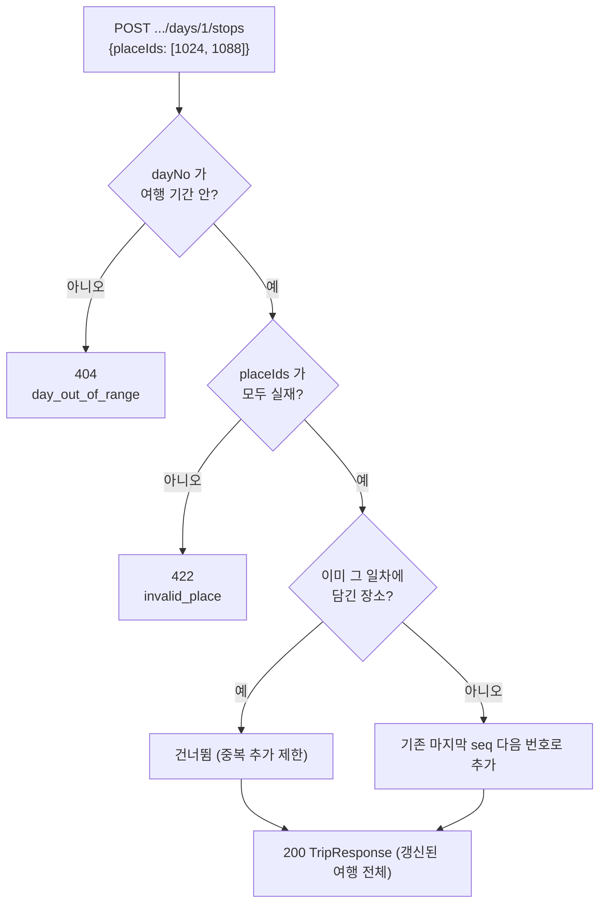

# API 명세

Base URL: `https://api.trippaw.app` (prod) / `http://localhost:8080` (local)

> **이 문서는 실제 구현된 엔드포인트만 기술한다(2026-08 기준).** 아직 코드로 존재하지 않는
> 것(사진 업로드 presign · AI 개인화 추천 · 알림 · 예약 · 체크리스트)은 구현될 때 여기에 추가한다.
> 화면 근거는 `userflow-spec.md`(온보딩·마이페이지) / `trip-explore-spec.md`(여행·탐색)를 참조.
>
> 현재 빌드는 버전 prefix(`/api/v1`) 없이 **`/api` 루트**로 서비스한다(예: `POST /api/pets`).

## 구현 현황

| Method | Path | 작업 단위 | 설명 |
|--------|------|:--------:|------|
| POST | `/api/auth/kakao` | — | 카카오 로그인 |
| POST | `/api/auth/apple` | — | 애플 로그인 |
| POST | `/api/auth/refresh` | — | 토큰 재발급(회전) |
| GET | `/api/auth/me` | — | 내 계정 조회 |
| PATCH | `/api/users/me` | 6 | 내 계정 수정(이름·프로필 이미지) |
| POST | `/api/auth/logout` | — | 로그아웃 |
| DELETE | `/api/auth/account` | — | 회원 탈퇴 |
| GET | `/api/terms` | 2 | 약관 목록(최신 버전) |
| POST | `/api/terms/agreements` | 2 | 약관 동의 제출 |
| GET | `/api/breeds?species=&q=` | 3 | 품종 목록·검색 |
| PUT | `/api/pets/draft` | 3 | 반려동물 등록 임시 저장 |
| GET | `/api/pets/draft` | 3 | 임시 저장 복원 |
| POST | `/api/pets` | 3 | 반려동물 등록(최대 5) |
| GET | `/api/pets` | 3 | 내 반려동물 목록(등록순) |
| GET | `/api/pets/{id}` | 3 | 반려동물 상세 |
| PATCH | `/api/pets/{id}` | 3 | 반려동물 수정 |
| DELETE | `/api/pets/{id}` | 3 | 반려동물 삭제 |
| GET | `/api/places/map` | 4 | 지도 마커·클러스터(BBox) |
| GET | `/api/places/search?q=` | 4 | 장소 검색(관련도순) |
| GET | `/api/places/recommended` | 4 | 추천 장소(비개인화) |
| GET | `/api/places` | 4 | 장소 목록(필터·정렬·커서) |
| GET | `/api/places/{id}` | 4 | 장소 상세 |
| GET | `/api/saved-places` | 4 | 저장한 장소(최신순) |
| GET | `/api/saved-places/categories` | 4 | 저장 카테고리 Chip·개수 |
| POST | `/api/saved-places` | 4 | 장소 저장(멱등) |
| DELETE | `/api/saved-places/{placeId}` | 4 | 저장 해제(멱등) |
| GET | `/api/trips?status=` | 5 | 여행 목록 + 대표 카드 |
| POST | `/api/trips` | 5 | 여행 만들기 |
| GET | `/api/trips/{id}` | 5 | 여행 상세(일차 전체) |
| PATCH | `/api/trips/{id}` | 5 | 여행 정보 수정 |
| DELETE | `/api/trips/{id}` | 5 | 여행 삭제 |
| POST | `/api/trips/{id}/duplicate` | 5 | 여행 복제(전체) |
| POST | `/api/trips/{id}/generate` | 45 | AI 루트로 채우기 |
| POST | `/api/trips/{id}/days/{dayNo}/stops` | 5 | 일정 담기(복수·멱등) |
| DELETE | `/api/trips/{id}/days/{dayNo}/stops/{seq}` | 5 | 일정 삭제 |
| PATCH | `/api/trips/{id}/days/{dayNo}/reorder` | 5 | 일정 순서 변경 |
| POST | `/api/images` | 44 | 이미지 업로드 |
| GET | `/api/images/{id}` | 44 | 이미지 조회 |
| GET | `/health` | — | 헬스체크(인증 없음) |

**아직 없는 것** — AI 개인화 추천 · 알림 · 예약 · 체크리스트.

## 목차

- [공통 사항](#공통-사항)
- [온보딩 흐름](#온보딩-흐름)
- [Auth API](#auth-api)
- [Terms API](#terms-api)
- [Pet API](#pet-api)
- [Place API](#place-api)
- [SavedPlace API](#savedplace-api)
- [Trip API](#trip-api)
- [Image API](#image-api)
- [에러 코드 전체 목록](#에러-코드-전체-목록)

---

## 공통 사항

### 인증

액세스 토큰(JWT)을 `Authorization` 헤더로 보낸다.

```
Authorization: Bearer <accessToken>
```

| 구분 | 경로 |
|------|------|
| 공개(토큰 불필요) | `POST /api/auth/{kakao,apple,refresh}` · `GET /api/terms` · `GET /health` |
| 보호 | 그 외 전부 |

- 액세스 토큰 수명은 응답의 `expiresIn`(초, 기본 3600). 만료 전에 `POST /api/auth/refresh`로 갱신한다.
- **리프레시는 회전(rotation) 방식이다.** 재발급하면 쓴 리프레시 토큰은 즉시 무효가 되므로, 같은 토큰을 두 번 쓰면 두 번째는 `invalid_refresh_token`으로 실패한다. 응답으로 받은 새 토큰 쌍을 반드시 저장할 것.
- 리프레시 토큰을 액세스 토큰 자리에 넣으면 `invalid_access_token`이 나간다(수명이 긴 토큰이 보호 라우트를 통과하지 못하게 종류를 구분한다).

### 응답 형식

**성공은 리소스 본문을 그대로 준다. 봉투(envelope)로 감싸지 않는다.**

```json
{ "id": "550e8400-e29b-41d4-a716-446655440000", "name": "보리" }
```

본문이 없는 성공은 `204 No Content`다.

**실패는 RFC 7807 형식이다.**

```json
{
  "type": "about:blank",
  "title": "Unprocessable Entity",
  "status": 422,
  "detail": "이름은 12자 이하여야 합니다",
  "code": "invalid_pet_name"
}
```

> **클라이언트 분기는 `code`로만 한다.** `detail`은 사람이 읽는 문장이라 문구가 바뀔 수 있고, `title`은 HTTP 상태 텍스트라 정보가 없다.

### 공통 에러 코드

| code | HTTP | 사용처 |
|------|------|------|
| `invalid_request` | 400 | 본문 파싱 실패·필수 필드 누락·쿼리 파라미터 형식 오류 |
| `unauthorized` | 401 | `Authorization` 헤더가 없거나 형식이 잘못됨 |
| `invalid_access_token` | 401 | 액세스 토큰이 유효하지 않거나 만료됨(또는 리프레시 토큰을 보냄) |
| `forbidden` | 403 | 남의 리소스 접근 |
| `not_found` | 404 | 리소스 없음 |
| `internal_error` | 500 | 그 외 |

### 형식

- **시각**: RFC 3339 UTC — `2026-08-16T01:29:00Z`
- **날짜**: `YYYY-MM-DD` — `2026-07-22`
- **ID**: user·pet·trip은 UUID 문자열, place는 정수(int64)
- **JSON 키**: lowerCamelCase
- **빈 목록**: `404`가 아니라 `{"items": []}`. 목록 필드는 `null`이 아니라 항상 배열이다

### 페이지네이션

목록은 두 방식을 쓴다. **어느 쪽인지는 엔드포인트마다 다르다.**

| 방식 | 쓰는 곳 | 파라미터 | 다음 페이지 |
|------|--------|---------|-----------|
| 커서 | `/api/places` · `/api/saved-places` | `cursor`, `limit` | `nextCursor`가 `null`이면 마지막 |
| offset | `/api/trips` | `offset`, `limit` | `nextOffset`이 `null`이면 마지막 |

`limit`은 기본 20, 최대 100(초과하면 100으로 깎는다).

> **커서는 불투명한 문자열이다.** 안에 정렬 키가 들어 있지만 그건 서버 사정이고 언제든 바뀐다. 직접 만들어 보내지 말고 응답으로 받은 값을 그대로 다시 보낼 것. 형식이 깨진 커서는 `invalid_cursor`(400).
>
> 여행 목록만 offset 인 이유 — 대표 여행 1건을 목록에서 빼야 하는데, 커서 경계와 제외 규칙이 겹치면 페이지마다 개수가 어긋난다. 여행은 사용자당 수십 건 규모라 offset으로 충분하다.

---

## 온보딩 흐름

로그인 응답의 `nextStep`이 다음 화면을 정한다. 클라이언트가 약관 동의 여부나 등록 진행 상태를 따로 조회할 필요가 없다.



`nextStep` 판정 우선순위:

| 값 | 조건 |
|------|------|
| `terms` | 필수 약관 중 최신 버전에 동의하지 않은 것이 있다 |
| `pet_profile` | 등록하다 만 반려동물 프로필(draft)이 있다 |
| `home` | 그 외 |

> **반려동물이 0마리여도 `home`이다.** 미등록은 정상 상태이고, 홈의 "반려동물 등록하기" 배너가 그 경우를 처리한다.
>
> 약관이 개정되면 이미 가입한 회원도 자동으로 `terms`로 돌아간다(최신 버전 기준으로 판정하기 때문).

---

## Auth API

| Method | Path | 인증 | 설명 |
|--------|------|:----:|------|
| POST | `/api/auth/kakao` | — | 카카오 로그인 |
| POST | `/api/auth/apple` | — | 애플 로그인 |
| POST | `/api/auth/refresh` | — | 토큰 재발급 |
| GET | `/api/auth/me` | ✅ | 내 계정 조회 |
| PATCH | `/api/users/me` | ✅ | 내 계정 수정 |
| POST | `/api/auth/logout` | ✅ | 로그아웃 |
| DELETE | `/api/auth/account` | ✅ | 회원 탈퇴 |

---

### POST /api/auth/kakao

앱의 카카오 SDK가 받아온 액세스 토큰으로 로그인한다. 처음이면 가입까지 함께 처리한다.

**Request Body**

| 필드 | 타입 | 필수 | 설명 |
|------|------|:----:|------|
| `accessToken` | String | ✅ | 카카오 SDK 액세스 토큰 |

**Response `200`**

```json
{
  "accessToken": "eyJhbGciOi...",
  "refreshToken": "eyJhbGciOi...",
  "expiresIn": 3600,
  "user": {
    "id": "550e8400-e29b-41d4-a716-446655440000",
    "provider": "kakao",
    "email": "user@example.com",
    "nickname": "김도윤",
    "profileImage": "https://k.kakaocdn.net/...",
    "createdAt": "2026-08-16T01:29:00Z",
    "lastLoginAt": "2026-08-16T01:29:00Z"
  },
  "nextStep": "terms"
}
```

| 필드 | 타입 | 설명 |
|------|------|------|
| `accessToken` | String | 보호 라우트에 쓸 JWT |
| `refreshToken` | String | 재발급용. 회전 방식이라 쓰면 무효가 된다 |
| `expiresIn` | Int | 액세스 토큰 수명(초) |
| `user.email` | String? | 공급자가 주지 않으면 `null` |
| `user.nickname` | String? | 최대 20자 |
| `user.profileImage` | String? | 없으면 `null` — 클라이언트가 기본 이미지를 쓴다 |
| `nextStep` | String | `terms` \| `pet_profile` \| `home` |

**Error Codes**

| code | HTTP | 발생 조건 |
|------|------|---------|
| `invalid_request` | 400 | `accessToken` 누락 |
| `provider_rejected` | 401 | 카카오가 토큰을 거부(만료·다른 앱의 토큰 등) |

---

### POST /api/auth/apple

**Request Body**

| 필드 | 타입 | 필수 | 설명 |
|------|------|:----:|------|
| `code` | String | ✅ | Sign in with Apple authorization code |
| `nickname` | String? | | 사용자 표시 이름 |

> **`nickname`은 최초 인증 때 반드시 함께 보내야 한다.** 애플은 `id_token`에 이름을 담지 않고 `ASAuthorizationAppleIDCredential.fullName`으로 클라이언트에만, 그것도 **처음 한 번만** 준다. 이때 놓치면 서버가 애플에 다시 요청할 방법이 없다. 두 번째 로그인부터는 비워도 처음 저장한 값이 유지된다.

응답은 `POST /api/auth/kakao`와 동일(`provider`가 `"apple"`).

**Error Codes**

| code | HTTP | 발생 조건 |
|------|------|---------|
| `invalid_request` | 400 | `code` 누락 |
| `provider_rejected` | 401 | 애플이 code를 거부(만료·재사용) |

---

### POST /api/auth/refresh

**Request Body**

| 필드 | 타입 | 필수 | 설명 |
|------|------|:----:|------|
| `refreshToken` | String | ✅ | 발급받은 리프레시 토큰 |

**Response `200`**

```json
{
  "accessToken": "eyJhbGciOi...",
  "refreshToken": "eyJhbGciOi...",
  "expiresIn": 3600
}
```

> 재발급 응답에는 `user`와 `nextStep`이 없다. 필요하면 `GET /api/auth/me`를 부른다.

**Error Codes**

| code | HTTP | 발생 조건 |
|------|------|---------|
| `invalid_request` | 400 | `refreshToken` 누락 |
| `invalid_refresh_token` | 401 | 만료·없음·이미 사용됨(회전으로 무효화) |

---

### GET /api/auth/me

`UserResponse`(위 `user` 객체와 동일)를 돌려준다. MY_001 "내 계정", MY_002 "간편로그인" 표시에 쓴다.

---

### PATCH /api/users/me

이름과 프로필 이미지를 고친다.

**Request Body** — 보낸 필드만 바뀐다.

| 필드 | 타입 | 필수 | 설명 |
|------|------|:----:|------|
| `nickname` | String? | | 1~20자. 앞뒤 공백은 제거하고 저장 |
| `profileImage` | String? | | `POST /api/images` 가 돌려준 `url`. **`null`로 보내면 삭제** |

> **`profileImage`는 세 상태가 다르다.**
>
> | 보낸 것 | 결과 |
> |---------|------|
> | 키 없음 | 그대로 둔다 |
> | `"profileImage": null` | 지운다 → 클라이언트가 기본 이미지 사용 |
> | `"profileImage": "https://..."` | 바꾼다 |
>
> 이메일은 수정할 수 없다. 요청에 담아도 **오류 없이 무시**한다.

**Response `200`** — `UserResponse`

**Error Codes**

| code | HTTP | 발생 조건 |
|------|------|---------|
| `invalid_request` | 400 | 본문 파싱 실패 |
| `invalid_nickname` | 422 | 공백만이거나 20자 초과 |
| `invalid_photo_url` | 422 | 절대 http(s) 주소가 아님 |

---

### POST /api/auth/logout

그 사용자의 리프레시 토큰을 전부 지운다(모든 기기에서 로그아웃). 본문 없음, 응답 `204`.

> 이미 발급된 액세스 토큰은 만료될 때까지(기본 1시간) 유효하다. 서버에 상태를 두지 않는 JWT의 특성이다.

---

### DELETE /api/auth/account

회원 탈퇴. **즉시 완전 삭제**이며 복구할 수 없다.

**Request Body** — 카카오 사용자는 본문 없이 호출해도 된다.

| 필드 | 타입 | 필수 | 설명 |
|------|------|:----:|------|
| `code` | String | 애플만 ✅ | 새 authorization code |

> 애플은 "앱에서 탈퇴하면 설정 > Apple ID의 연동도 끊겨야 한다"는 심사 기준이 있어서, 클라이언트가 탈퇴 요청에 **새 code**를 함께 보내야 서버가 애플에 revoke를 호출할 수 있다. revoke가 실패하면 사용자를 지우지 않는다.

**함께 지워지는 것** — 반려동물 프로필 · 저장한 장소 · 여행과 일정 · 약관 동의 이력 · 임시 저장 · 리프레시 토큰.

응답 `204`.

**Error Codes**

| code | HTTP | 발생 조건 |
|------|------|---------|
| `apple_code_required` | 400 | 애플 사용자가 `code` 없이 요청 |
| `user_not_found` | 404 | 이미 탈퇴한 사용자 |

---

## Terms API

| Method | Path | 인증 | 설명 |
|--------|------|:----:|------|
| GET | `/api/terms` | — | 약관 목록(각 종류의 최신 버전) |
| POST | `/api/terms/agreements` | ✅ | 동의 제출 |

---

### GET /api/terms

각 약관 종류의 **최신 버전 1건씩만** 화면 노출 순서대로 돌려준다. 가입 전에 봐야 하므로 인증이 필요 없다.

**Response `200`**

```json
{
  "items": [
    { "id": 1, "code": "service",   "version": "1.0", "required": true,
      "title": "(필수) 서비스 이용약관", "contentUrl": "https://trippaw.app/terms/service" },
    { "id": 2, "code": "privacy",   "version": "1.0", "required": true,
      "title": "(필수) 개인정보 수집 및 이용", "contentUrl": "https://trippaw.app/terms/privacy" },
    { "id": 3, "code": "location",  "version": "1.0", "required": true,
      "title": "(필수) 위치기반 서비스 이용약관", "contentUrl": "https://trippaw.app/terms/location" },
    { "id": 4, "code": "marketing", "version": "1.0", "required": false,
      "title": "(선택) 마케팅 정보 수신 동의", "contentUrl": "https://trippaw.app/terms/marketing" }
  ]
}
```

| 필드 | 타입 | 설명 |
|------|------|------|
| `id` | Int | 동의 제출에 쓸 식별자. **버전마다 다르다** |
| `code` | String | `service` \| `privacy` \| `location` \| `marketing`. 버전이 올라가도 그대로 |
| `required` | Boolean | 필수 여부 |
| `contentUrl` | String | 상세 보기용 웹뷰 주소 |

- 정렬은 `service → privacy → location → marketing` 고정이다.
- MY_006 "약관 및 정책"은 이 중 `service`·`privacy`의 `contentUrl`을 쓴다.
- 별도의 약관 상세 API는 없다. `contentUrl`을 웹뷰로 연다.

---

### POST /api/terms/agreements

**Request Body**

| 필드 | 타입 | 필수 | 설명 |
|------|------|:----:|------|
| `agreements` | Array | ✅ | 항목 목록 |
| `agreements[].termId` | Int | ✅ | `GET /api/terms`의 `id` |
| `agreements[].agreed` | Boolean | ✅ | 동의 여부 |

```json
{
  "agreements": [
    { "termId": 1, "agreed": true },
    { "termId": 2, "agreed": true },
    { "termId": 3, "agreed": true },
    { "termId": 4, "agreed": false }
  ]
}
```

**Response `204`**

> - **필수 약관이 하나라도 `false`이거나 목록에서 빠지면 전체가 거부된다**(부분 저장 없음). 빠뜨린 것과 거부한 것을 구분하지 않는다.
> - 같은 약관에 다시 제출하면 덮어쓴다. **마케팅 수신 철회가 이 경로다** — `agreed: false`로 다시 제출하면 되고, 서버는 행을 지우지 않고 철회 시점을 기록으로 남긴다.
> - "전체 동의 토글"·"개별 토글"·"필수 미동의 시 CTA 비활성화"는 전부 클라이언트 상태다. 서버는 최종 제출만 검증한다.

**Error Codes**

| code | HTTP | 발생 조건 |
|------|------|---------|
| `invalid_request` | 400 | `agreements` 누락, 항목에 `termId`/`agreed` 누락 |
| `required_terms_not_agreed` | 422 | 필수 약관 미동의 또는 목록 누락 |

---

## Pet API

| Method | Path | 인증 | 설명 |
|--------|------|:----:|------|
| GET | `/api/breeds?species=&q=` | ✅ | 품종 목록·검색 |
| PUT | `/api/pets/draft` | ✅ | 임시 저장 |
| GET | `/api/pets/draft` | ✅ | 임시 저장 복원 |
| POST | `/api/pets` | ✅ | 등록(최대 5) |
| GET | `/api/pets` | ✅ | 목록(등록순) |
| GET | `/api/pets/{id}` | ✅ | 상세 |
| PATCH | `/api/pets/{id}` | ✅ | 수정 |
| DELETE | `/api/pets/{id}` | ✅ | 삭제 |

### 검증 규칙 (등록·수정 공통)

| 필드 | 규칙 | 위반 시 code |
|------|------|------------|
| `name` | 1~12자. 한글·영문·숫자·공백만. 앞뒤 공백 제거 후 판정 | `invalid_pet_name` |
| `species` | `dog` \| `cat` | `invalid_species` |
| `breedId` | 필수. **그 종의 품종이어야 한다** | `invalid_breed` |
| `size` | `small` \| `medium` \| `large` | `invalid_size` |
| `gender` | `male` \| `female` | `invalid_gender` |
| `neutered` | `done` \| `not_done` \| `unknown` | `invalid_neutered` |
| `traits` | 0~3개. 중복 불가. `active`·`calm`·`social`·`timid`·`curious` | `invalid_traits` |
| `photoUrl` | 선택. `POST /api/images` 가 돌려준 `url` | `invalid_photo_url` |

> 이름 규칙은 이모지·특수문자·줄바꿈을 막는다(`보리🐶`, `보리!` 모두 거부). 길이는 **글자 수**로 센다 — `보리`는 6바이트지만 2자다.
>
> 화면의 `0/12` 카운터와 "다음 버튼 비활성화"는 클라이언트 표현이다. 서버는 값만 본다.

---

### GET /api/breeds

품종 선택 Bottom Sheet용.

**Query Parameters**

| 파라미터 | 타입 | 필수 | 설명 |
|------|------|:----:|------|
| `species` | String | ✅ | `dog` \| `cat` |
| `q` | String | | 검색어. 부분 일치 |

예: `GET /api/breeds?species=dog&q=리트리버`

**Response `200`**

```json
{ "items": [ { "id": 1, "name": "골든 리트리버", "imageUrl": null } ] }
```

- 정렬은 **가나다순(= 초성순)** 이다. 강아지 27건 / 고양이 30건, 총 57건이라 페이지네이션이 없다.
- 검색 결과 0건은 `404`가 아니라 `{"items": []}`(화면의 Empty 상태).
- `imageUrl`은 아직 전부 `null`이다(디자인에 자리만 있음).

**Error Codes**

| code | HTTP | 발생 조건 |
|------|------|---------|
| `invalid_request` | 400 | `species` 누락 또는 `dog`/`cat` 이외 값 |

---

### PUT /api/pets/draft

등록하다 만 입력을 저장한다. **"다음"·"뒤로가기"·"나중에 하기" 세 경우 모두 이 엔드포인트를 부른다.**

**Request Body**

| 필드 | 타입 | 필수 | 설명 |
|------|------|:----:|------|
| `step` | Int | ✅ | `1`(기본 정보) \| `2`(상세 정보) |
| `payload` | Object | ✅ | 부분 입력. 아래 키만 허용 |

```json
{
  "step": 1,
  "payload": {
    "name": "보리", "species": "dog", "breedId": 8, "photoUrl": null,
    "size": null, "gender": null, "neutered": null, "traits": []
  }
}
```

> **값 검증을 하지 않는다.** "다음"을 누르는 시점에는 이름만 있고 나머지가 비어 있는 게 정상이라, 여기서 등록 규칙을 적용하면 임시 저장 자체가 불가능하다. 검증은 `POST /api/pets`에서만 한다.
>
> 단, **키 집합은 검증한다.** 위 8개 외의 키(오타 포함)를 보내면 `invalid_request`다. 조용히 저장했다가 복원 때 사라지면 원인을 찾기 어렵기 때문이다.

사용자당 1행이라 여러 번 호출하면 덮어쓴다. 응답 `204`.

**Error Codes**

| code | HTTP | 발생 조건 |
|------|------|---------|
| `invalid_request` | 400 | `step`이 1·2가 아님, `payload` 누락, 알 수 없는 키 |

---

### GET /api/pets/draft

**Response `200`**

```json
{
  "step": 1,
  "payload": { "name": "보리", "species": "dog", "breedId": 8 },
  "updatedAt": "2026-08-16T01:29:00Z"
}
```

**Error Codes**

| code | HTTP | 발생 조건 |
|------|------|---------|
| `draft_not_found` | 404 | 임시 저장된 것이 없음(정상 상태 — 처음부터 입력) |

---

### POST /api/pets

**Request Body** — [검증 규칙](#검증-규칙-등록수정-공통) 참조.

```json
{
  "name": "보리", "species": "dog", "breedId": 8, "size": "medium",
  "gender": "male", "neutered": "done", "traits": ["active", "social"],
  "photoUrl": null
}
```

**Response `201`**

```json
{
  "id": "550e8400-e29b-41d4-a716-446655440000",
  "name": "보리",
  "species": "dog",
  "breed": { "id": 8, "name": "보더콜리" },
  "size": "medium",
  "gender": "male",
  "neutered": "done",
  "traits": ["active", "social"],
  "photoUrl": null,
  "weightKg": null,
  "createdAt": "2026-08-16T01:29:00Z",
  "updatedAt": "2026-08-16T01:29:00Z"
}
```

| 필드 | 타입 | 설명 |
|------|------|------|
| `breed` | Object? | 품종. `{id, name}` |
| `traits` | Array | 항상 배열. 없으면 `[]` |
| `photoUrl` | String? | `null`이면 클라이언트가 기본 이미지를 쓴다 |
| `weightKg` | Number? | 화면 입력 항목이 아니다(추천 로직용, 현재 항상 `null`) |

> **등록이 성공하면 임시 저장(draft)은 같은 트랜잭션에서 사라진다.** 따로 삭제 API를 부를 필요가 없다.

**Error Codes**

| code | HTTP | 발생 조건 |
|------|------|---------|
| `invalid_request` | 400 | 본문 파싱 실패 |
| `invalid_pet_name` 외 | 422 | [검증 규칙](#검증-규칙-등록수정-공통) 위반 |
| `pet_limit_exceeded` | 409 | 이미 5마리 등록됨 |

---

### GET /api/pets

**Response `200`**

```json
{
  "items": [ { "id": "...", "name": "보리", "...": "..." } ],
  "count": 2
}
```

- 정렬은 **등록순**(`createdAt` 오름차순).
- `count`는 화면의 "반려동물 2" 표시용. `0`이면 Empty 상태다.
- 최대 5건이라 페이지네이션이 없다.

---

### GET /api/pets/{id} · PATCH /api/pets/{id} · DELETE /api/pets/{id}

조회·수정·삭제. 수정은 **보낸 필드만** 바뀐다.

**PATCH Request Body** — 전부 선택.

| 필드 | 타입 | 설명 |
|------|------|------|
| `name`·`species`·`breedId`·`size`·`gender`·`neutered` | | 보낸 것만 갱신 |
| `traits` | Array? | `[]`를 보내면 **성향 전체 해제** |
| `photoUrl` | String? | `null`을 보내면 **사진 삭제** (키를 빼면 그대로 둠) |

> **종만 바꾸고 품종을 그대로 두면 거부된다**(`invalid_breed`). 강아지 품종이 고양이 프로필에 남기 때문이다. 종을 바꿀 때는 `breedId`도 함께 보낼 것.

**Response** — `GET`/`PATCH`는 `200` + `PetResponse`, `DELETE`는 `204`.

**Error Codes**

| code | HTTP | 발생 조건 |
|------|------|---------|
| `not_found` | 404 | 없는 ID(UUID 형식이 아닌 경우 포함) |
| `forbidden` | 403 | 다른 사용자의 반려동물 |
| `invalid_breed` 외 | 422 | [검증 규칙](#검증-규칙-등록수정-공통) 위반 |

---

## Place API

| Method | Path | 인증 | 설명 |
|--------|------|:----:|------|
| GET | `/api/places/map` | ✅ | 지도 마커·클러스터 |
| GET | `/api/places/search?q=` | ✅ | 검색(관련도순) |
| GET | `/api/places/recommended` | ✅ | 추천(비개인화) |
| GET | `/api/places` | ✅ | 목록(필터·정렬·커서) |
| GET | `/api/places/{id}` | ✅ | 상세 |

### 공통 필터 파라미터

`GET /api/places/map`과 `GET /api/places`가 함께 쓴다. 전부 선택이며, 보내지 않으면 그 조건을 걸지 않는다.

| 파라미터 | 타입 | 설명 |
|------|------|------|
| `category` | String | 단일 선택. **데이터가 있는 값**: `shop` `attraction` `stay` `restaurant` `cafe` `culture` `leisure`. `park` `beach` `vet` `pharmacy` `other` 는 스키마에는 있으나 현재 수집 데이터가 0건이다 |
| `maxWeightKg` | Number | 반려동물 무게. 이 무게가 들어갈 수 있는 곳만 |
| `area` | String | `indoor` \| `outdoor` |
| `maxFeeKrw` | Int | 추가요금 상한 |
| `leash` | Boolean | 목줄 필수 여부 |
| `muzzle` | Boolean | 입마개 필수 여부 |
| `facilities` | String | 쉼표 구분. `parking`, `wasteBag` |

> **정보가 없는 항목은 "제한 없음"으로 보고 통과시킨다.** 원본 데이터의 공백률이 높아서(추가요금은 97%가 미상), 값이 없는 곳을 떨어뜨리면 필터를 하나만 걸어도 결과가 거의 남지 않는다.
>
> | 필터 | 정보가 없을 때 |
> |------|-------------|
> | `maxWeightKg` | 통과(무게 제한이 없는 것으로 봄) |
> | `area` | 통과(실내·야외 어느 쪽으로 걸러도) |
> | `maxFeeKrw` | 0원으로 취급 |
> | `leash`·`muzzle` | 통과(단정할 수 없으므로) |
> | `facilities` | **제외**(있다고 확인된 곳만 원하는 필터이므로) |
>
> 화면의 편의시설 Chip 중 **무선인터넷·자동결제·발 세척 시설·샤워장은 아직 지원하지 않는다**(수집 데이터에 해당 항목이 없음). 보내면 `invalid_request`로 거절한다 — 조용히 무시하면 "필터가 안 먹는다"로 헤매게 된다.

---

### GET /api/places/map

지도 영역 안의 장소를 마커로 준다. **밀집 구간은 서버가 격자로 묶어 클러스터로 내려보낸다** — 좌표 수천 개를 그대로 주고 클라이언트가 묶게 하면 모바일에서 감당이 안 된다.



**Query Parameters**

| 파라미터 | 타입 | 필수 | 설명 |
|------|------|:----:|------|
| `minLat`,`maxLat`,`minLng`,`maxLng` | Number | ✅ | 현재 지도 영역 |
| `zoom` | Int | ✅ | 지도 줌 레벨. 클러스터 격자 크기를 정한다 |
| [공통 필터](#공통-필터-파라미터) | | | |

예: `GET /api/places/map?minLat=33.2&maxLat=33.6&minLng=126.2&maxLng=126.9&zoom=12&category=cafe`

**Response `200`**

```json
{
  "markers": [
    { "type": "place", "placeId": 1024, "name": "광치기해변",
      "category": "attraction", "lat": 33.3939, "lng": 126.2396 },
    { "type": "cluster", "lat": 33.4102, "lng": 126.3011, "count": 5 }
  ],
  "total": 42
}
```

| 필드 | 타입 | 설명 |
|------|------|------|
| `type` | String | `place`(단일) \| `cluster`(뭉침) |
| `placeId`·`name`·`category` | | `type`이 `place`일 때만 있다 |
| `lat`,`lng` | Number | 클러스터는 속한 장소들의 평균 좌표 |
| `count` | Int | `cluster`일 때만. 화면의 `+n` |
| `total` | Int | 필터에 걸린 전체 개수. "추천 장소 N곳" 표시에 쓴다 |

> **클러스터에는 대표 장소 정보가 없다.** 탭하면 확대해서 다시 조회하는 흐름이라 개별 장소가 필요 없기 때문이다.
>
> 줌이 커질수록 격자가 작아져 클러스터가 흩어진다(zoom 11에서 하나로 묶인 3곳이 zoom 20에서는 마커 3개).

**Error Codes**

| code | HTTP | 발생 조건 |
|------|------|---------|
| `invalid_request` | 400 | BBox·`zoom` 누락, 좌표 뒤집힘, 알 수 없는 카테고리·필터 값 |

---

### GET /api/places/search

**Query Parameters**

| 파라미터 | 타입 | 필수 | 설명 |
|------|------|:----:|------|
| `q` | String | ✅ | 검색어. 장소명 부분 일치 |
| `limit` | Int | | 기본 20, 최대 100 |

**Response `200`** — `{ "items": [PlaceResponse, ...] }` ([PlaceResponse](#placeresponse-공통) 참조)

- **관련도순 정렬이다.** 접두 일치가 부분 일치보다 앞에 온다 — `광치기`로 찾으면 「광치기해변」이 「광치기로 카페」보다 위다. 같은 등급에서는 이름이 짧은 쪽이 먼저다.
- 결과 0건은 `{"items": []}`. 화면은 "검색 결과가 없어요"를 보여준다.
- `q`가 비었거나 공백뿐이면 빈 목록이다(오류 아님).
- **최근 검색어는 서버에 저장하지 않는다.** 클라이언트 로컬에 둔다.
- 검색 결과 화면(지도+리스트 동시)은 이 API와 `GET /api/places/map`을 같은 조건으로 함께 부르면 된다.

---

### GET /api/places/recommended

반려동물 프로필이 없어도 볼 수 있는 **개인화되지 않은 인기·대표 장소**다.

**Query Parameters**

| 파라미터 | 타입 | 필수 | 설명 |
|------|------|:----:|------|
| `limit` | Int | | 기본 **10**(화면이 최대 10개) |

**Response `200`** — `{ "items": [PlaceResponse, ...] }`

> **`shop`(쇼핑) 카테고리는 추천에서 제외한다.** 수집 데이터의 52%가 아울렛 매장이라
> 넣어두면 추천 캐러셀이 매장 목록이 된다.
>
> **현재 랭킹은 임시다.** 조회수·저장수 같은 인기 신호가 아직 쌓이지 않아서 "동반 가능이 확실하고 → 사진이 있고 → 근거 신뢰도가 높은 순"으로 대신하고 있다. 저장 데이터가 쌓이면 기준이 바뀐다(응답 형태는 그대로).
>
> `petId`를 받는 개인화 추천은 아직 없다. AI 기반으로 간다는 것만 정해졌고 입력·출력이 미정이다.

---

### GET /api/places

**Query Parameters**

| 파라미터 | 타입 | 필수 | 설명 |
|------|------|:----:|------|
| `sort` | String | | `distance`(기본) \| `name` |
| `lat`,`lng` | Number | | 현재 위치. `sort=distance`에 필요 |
| `cursor` | String | | 이전 응답의 `nextCursor` |
| `limit` | Int | | 기본 20, 최대 100 |
| [공통 필터](#공통-필터-파라미터) | | | |

**Response `200`**

```json
{
  "items": [ { "placeId": 1024, "name": "광치기해변", "...": "..." } ],
  "total": 42,
  "nextCursor": "eyJuIjoxMjM0LjUsImlkIjoxMDI0fQ"
}
```

- `total`은 필터에 걸린 전체 개수(현재 페이지 수가 아니다).
- `nextCursor`가 `null`이면 마지막 페이지다.
- **좌표 없이 `sort=distance`를 요청하면 오류가 아니라 ID순으로 떨어진다.** 위치 권한을 거부한 사용자에게 빈 화면을 주지 않기 위해서다. 이때 `distanceM`은 응답에 없다.

**Error Codes**

| code | HTTP | 발생 조건 |
|------|------|---------|
| `invalid_request` | 400 | 알 수 없는 카테고리·필터 값 |
| `invalid_cursor` | 400 | 커서 형식이 깨짐 |

---

### GET /api/places/{id}

**Response `200`** — [PlaceResponse](#placeresponse-공통) + `images`

```json
{
  "placeId": 1024,
  "name": "광치기해변",
  "category": "attraction",
  "roadAddress": "서귀포시 성산읍 고성리",
  "tel": "064-796-2404",
  "lat": 33.3939,
  "lng": 126.2396,
  "imageUrl": "https://cdn.trippaw.app/places/1024-main.jpg",
  "imageCount": 3,
  "openTime": "09:00-일몰",
  "petConditions": ["대형견", "야외 동반", "리드줄 필수", "동반요금 없음", "주차 가능"],
  "needsVerification": false,
  "isSaved": false,
  "images": [
    "https://cdn.trippaw.app/places/1024-main.jpg",
    "https://cdn.trippaw.app/places/1024-2.jpg",
    "https://cdn.trippaw.app/places/1024-3.jpg"
  ]
}
```

**Error Codes**

| code | HTTP | 발생 조건 |
|------|------|---------|
| `not_found` | 404 | 없는 장소(정수가 아닌 ID 포함) |

---

### PlaceResponse (공통)

목록·검색·추천·저장한 장소·상세가 모두 같은 구조를 쓴다.

| 필드 | 타입 | 설명 |
|------|------|------|
| `placeId` | Int | 장소 식별자 |
| `name` | String | 장소명 |
| `category` | String | 카테고리 |
| `roadAddress` | String? | 도로명 주소 |
| `tel` | String? | 전화번호. 없으면 필드 자체가 빠진다 |
| `lat`,`lng` | Number | 좌표 |
| `imageUrl` | String? | 대표 사진 1장. **`null`이면 클라이언트가 Placeholder를 쓴다**(서버는 기본 이미지를 채우지 않는다) |
| `imageCount` | Int | 전체 사진 장수. "사진 N장" 표시에 쓴다 |
| `openTime` | String? | 영업시간 원문(예: `"09:00-일몰"`) |
| `petConditions` | Array | 화면에 그대로 뿌리는 문구들. 예: `["대형견", "리드줄 필수", "주차 가능"]` |
| `needsVerification` | Boolean | `true`면 **"동반 정책 확인 필요"** 라벨을 붙인다 |
| `isSaved` | Boolean | 내가 저장했는지 |
| `distanceM` | Number? | 미터. `lat`/`lng`를 준 조회에서만 있다 |

> **입마개는 두 종류가 다르다.** 수집된 39곳 중 38곳이 *맹견에게만* 입마개를 요구한다.
> 그래서 문구를 나눈다 — `"입마개 필수"`(모든 개) / `"맹견 입마개 필수"`(특정 견종만).
> 필터 `muzzle=true` 는 앞의 것만 걸러낸다.
>
> **`petConditions`는 값이 있는 항목만 담는다.** 원본 공백률이 높아 "정보 없음"을 일일이 넣으면 카드가 그 문구로 뒤덮인다. 배열이 짧다고 조건이 없는 게 아니라 **알려지지 않은 것**이다.
>
> **`isSaved` 덕분에 별도의 저장 상태 동기화 API가 필요 없다.** 탐색·상세·저장 목록이 모두 이 필드를 들고 온다.

---

## SavedPlace API

| Method | Path | 인증 | 설명 |
|--------|------|:----:|------|
| GET | `/api/saved-places` | ✅ | 저장 목록(최신순) |
| GET | `/api/saved-places/categories` | ✅ | 카테고리 Chip·개수 |
| POST | `/api/saved-places` | ✅ | 저장 |
| DELETE | `/api/saved-places/{placeId}` | ✅ | 저장 해제 |

---

### GET /api/saved-places

**Query Parameters**

| 파라미터 | 타입 | 필수 | 설명 |
|------|------|:----:|------|
| `category` | String | | 미지정이면 전체 |
| `cursor` | String | | 이전 응답의 `nextCursor` |
| `limit` | Int | | 기본 20, 최대 100 |

**Response `200`**

```json
{
  "items": [
    { "placeId": 1024, "name": "광치기해변", "isSaved": true,
      "savedAt": "2026-08-10T12:00:00Z", "...": "..." }
  ],
  "nextCursor": null
}
```

[PlaceResponse](#placeresponse-공통) + `savedAt`. 정렬은 **저장한 최신순**이다.

---

### GET /api/saved-places/categories

**Response `200`**

```json
{
  "total": 12,
  "items": [
    { "category": "cafe", "count": 5 },
    { "category": "attraction", "count": 3 }
  ]
}
```

- `total`은 저장한 전체 개수. MY_001의 "저장한 장소 N" 표시에 쓴다.
- **저장 건수가 0인 카테고리는 아예 나오지 않는다.** 노출 순서와 한글 라벨은 클라이언트가 정한다(명세와 디자인의 Chip 목록이 서로 달라, 서버는 실제 저장된 것만 집계한다).

---

### POST /api/saved-places · DELETE /api/saved-places/{placeId}

**POST Request Body**

| 필드 | 타입 | 필수 | 설명 |
|------|------|:----:|------|
| `placeId` | Int | ✅ | 저장할 장소 |

**Response** — 둘 다 본문이 없다.

| 상황 | 상태 코드 |
|------|---------|
| 새로 저장 | `201 Created` |
| 이미 저장돼 있음 | `200 OK` |
| 해제 | `204 No Content` |
| 저장돼 있지 않은데 해제 | `204 No Content` |

> **둘 다 멱등이다.** 같은 요청을 두 번 보내도 오류가 나지 않으므로, 네트워크 재시도나 따닥 탭을 클라이언트가 방어할 필요가 없다.

**Error Codes**

| code | HTTP | 발생 조건 |
|------|------|---------|
| `invalid_request` | 400 | `placeId` 누락 또는 0 이하 |
| `not_found` | 404 | 없는 장소를 저장하려 함 |

---

## Trip API

| Method | Path | 인증 | 설명 |
|--------|------|:----:|------|
| GET | `/api/trips?status=` | ✅ | 목록 + 대표 카드 |
| POST | `/api/trips` | ✅ | 만들기 |
| GET | `/api/trips/{id}` | ✅ | 상세 |
| PATCH | `/api/trips/{id}` | ✅ | 수정 |
| DELETE | `/api/trips/{id}` | ✅ | 삭제 |
| POST | `/api/trips/{id}/duplicate` | ✅ | 복제(전체) |
| POST | `/api/trips/{id}/generate` | ✅ | AI 루트로 채우기 |
| POST | `/api/trips/{id}/days/{dayNo}/stops` | ✅ | 일정 담기 |
| DELETE | `/api/trips/{id}/days/{dayNo}/stops/{seq}` | ✅ | 일정 삭제 |
| PATCH | `/api/trips/{id}/days/{dayNo}/reorder` | ✅ | 순서 변경 |

---

### GET /api/trips

여행 홈 한 화면에 필요한 것을 한 번에 준다.

**Query Parameters**

| 파라미터 | 타입 | 필수 | 설명 |
|------|------|:----:|------|
| `status` | String | | `upcoming`(기본) \| `past` |
| `offset` | Int | | 기본 0 |
| `limit` | Int | | 기본 20, 최대 100 |

**Response `200`**

```json
{
  "featured": {
    "id": "550e8400-e29b-41d4-a716-446655440000",
    "title": "제주 3박 4일",
    "startDate": "2026-08-23",
    "endDate": "2026-08-26",
    "dDay": -7,
    "placeCount": 3,
    "themes": ["nature"],
    "pets": [ { "id": "...", "name": "보리" } ]
  },
  "items": [
    { "id": "...", "title": "서귀포 나들이", "startDate": "2026-09-15",
      "endDate": "2026-09-20", "dDay": -30, "placeCount": 0,
      "themes": [], "pets": [] }
  ],
  "nextOffset": null
}
```

| 필드 | 타입 | 설명 |
|------|------|------|
| `featured` | Object? | 대표 여행 카드 1건. 없으면 `null` |
| `dDay` | Int? | **시작일까지 남은 일수.** 7일 뒤 출발이면 `-7`, 당일 `0`, 지난 뒤 양수 |
| `placeCount` | Int | 담긴 일정 개수 |
| `pets[].name` | String | 화면의 "보리와 함께"에 쓴다 |
| `nextOffset` | Int? | 다음 페이지 offset. `null`이면 마지막 |

**대표 여행(`featured`) 규칙**

- `status=upcoming`일 때만 채운다. **지난 여행 탭에는 대표 카드가 없다.**
- 진행 중인 여행이 있으면 그것, 없으면 시작일이 가장 가까운 것 1건.
- **`items`에서는 제외된다** — 같은 여행이 카드와 목록에 중복으로 나오지 않는다.

**다가오는 / 지난 경계**

| 탭 | 조건 | 정렬 |
|------|------|------|
| `upcoming` | 종료일이 오늘이거나 이후 | 시작일 가까운 순 |
| `past` | 종료일이 어제이거나 이전 | 종료일 최근 순 |

> **오늘 끝나는 여행은 아직 "다가오는"이다.** 경계는 시작일이 아니라 **종료일**이라, 진행 중인 여행도 다가오는 탭에 있다.
>
> `dDay`는 서버가 계산해 내려준다. 기기 시간을 바꾼 사용자에게 엉뚱한 D-Day가 보이지 않도록 클라이언트 시계로 다시 계산하지 말 것.

---

### POST /api/trips

**Request Body**

| 필드 | 타입 | 필수 | 설명 |
|------|------|:----:|------|
| `title` | String | ✅ | **최대 20자.** 앞뒤 공백 제거 후 저장 |
| `startDate` | String | ✅ | `YYYY-MM-DD` |
| `endDate` | String | ✅ | `YYYY-MM-DD`. 시작일과 같아도 된다(당일치기) |
| `petIds` | Array | | 동반 반려동물. **복수 선택 가능**. 첫 번째가 대표가 된다 |
| `themes` | Array | | 여행 테마. 문자열 자유 |

```json
{
  "title": "제주 3박 4일",
  "startDate": "2026-08-23",
  "endDate": "2026-08-26",
  "petIds": ["550e8400-e29b-41d4-a716-446655440000"],
  "themes": ["nature", "cafe"]
}
```

> **`themes`는 선택이다.** 화면 명세가 필수/선택으로 엇갈려 있어 서버는 느슨한 쪽으로 두었다. 빈 배열이나 생략을 허용하므로, CTA 활성화 조건은 클라이언트가 정하면 된다. 테마 코드 목록이 확정되기 전이라 **값 검증도 하지 않는다**(보낸 문자열을 그대로 저장).
>
> `3박 4일` 표기는 클라이언트가 날짜 차이로 계산한다.

**Response `201`** — [TripResponse](#tripresponse-공통). 생성 후 바로 상세 화면으로 가므로 전체 표현을 준다.

**Error Codes**

| code | HTTP | 발생 조건 |
|------|------|---------|
| `invalid_request` | 400 | 본문 파싱 실패 |
| `invalid_trip_title` | 422 | 비었거나 20자 초과 |
| `invalid_date_range` | 422 | 날짜 형식 오류, 또는 종료일이 시작일보다 앞 |
| `invalid_pets` | 422 | UUID 형식 오류, 또는 내 반려동물이 아님 |

---

### GET /api/trips/{id}

**Response `200`**

```json
{
  "id": "550e8400-e29b-41d4-a716-446655440000",
  "title": "제주 3박 4일",
  "startDate": "2026-08-23",
  "endDate": "2026-08-26",
  "dDay": -7,
  "placeCount": 3,
  "totalPlaceCount": 3,
  "themes": ["nature"],
  "pets": [ { "id": "...", "name": "보리" } ],
  "days": [
    {
      "dayNo": 1,
      "date": "2026-08-23",
      "stops": [
        { "seq": 1, "kind": "place", "placeId": 1024, "name": "광치기해변",
          "category": "attraction", "lat": 33.3939, "lng": 126.2396 },
        { "seq": 2, "kind": "place", "placeId": 1088, "name": "금능 카페",
          "category": "cafe", "lat": 33.3901, "lng": 126.2401 }
      ]
    },
    { "dayNo": 2, "date": "2026-08-24", "stops": [] },
    { "dayNo": 3, "date": "2026-08-25", "stops": [] },
    { "dayNo": 4, "date": "2026-08-26", "stops": [] }
  ]
}
```

| 필드 | 타입 | 설명 |
|------|------|------|
| `days` | Array | **여행 기간만큼 전부.** 일정이 없는 날도 빈 `stops`로 들어 있다 |
| `stops[].seq` | Int | 그 일차 안의 순서. **연속 번호가 아닐 수 있다**(1, 2, 4 등) |
| `stops[].kind` | String | 현재 항상 `"place"`. 예약 기능이 생기면 값이 늘어난다 |
| `totalPlaceCount` | Int | 전체 일정 개수(`placeCount`와 같은 값) |

> **`days`는 Day Tab의 원천이다.** 배열 길이가 곧 탭 개수이므로 클라이언트가 날짜를 계산할 필요가 없다.
>
> 지도 Pin은 `stops[].lat/lng`를 그대로 쓴다. 카카오내비 길안내 CTA 활성화(`stops.length >= 2`)도 이 응답으로 판단한다 — **별도의 경로 API는 없다.** 경유지와 목적지(마지막 일정)를 이 좌표로 조립하면 된다.
>
> `seq`에 구멍이 있어도 정상이다. 순서 판단은 `seq` 값의 크기로만 하고, 연속성을 가정하지 말 것.

---

### PATCH /api/trips/{id}

**Request Body** — 전부 선택. 보낸 필드만 바뀐다.

| 필드 | 타입 | 설명 |
|------|------|------|
| `title` | String | 최대 20자 |
| `startDate`·`endDate` | String | 한쪽만 보내도 나머지와 앞뒤가 맞아야 한다 |
| `petIds` | Array | 보내면 **목록 전체를 교체**한다 |
| `themes` | Array | 보내면 전체 교체 |

**Response `200`** — [TripResponse](#tripresponse-공통)

> **기간을 줄여서 사라지는 날에 일정이 남아 있으면 `409 stops_outside_range`로 거부한다.** 사용자가 직접 넣은 일정을 서버가 말없이 지우지 않기 때문이다. 클라이언트가 "N개 일정이 삭제됩니다" 확인을 받고 해당 일정을 지운 뒤 다시 요청해야 한다. 기간을 **늘리는 것은 언제나 된다**.

**Error Codes**

| code | HTTP | 발생 조건 |
|------|------|---------|
| `invalid_trip_title` | 422 | 비었거나 20자 초과 |
| `invalid_date_range` | 422 | 형식 오류 또는 종료일이 시작일보다 앞 |
| `invalid_pets` | 422 | 내 반려동물이 아님 |
| `stops_outside_range` | 409 | 줄어드는 기간에 일정이 남아 있음 |
| `forbidden` | 403 | 다른 사용자의 여행 |
| `not_found` | 404 | 없는 여행 |

---

### POST /api/trips/{id}/duplicate

현재 여행을 기준으로 새 여행을 만든다. **복제 범위는 전체** — 일정과 동반 반려동물까지 옮긴다.

**Response `201`** — 새 [TripResponse](#tripresponse-공통)

- 제목은 원본 뒤에 `" (복제)"`가 붙는다.
- **20자를 넘으면 잘린다.** 원본이 18자면 `" (복제)"`를 붙여 23자가 되는데, 자르지 않으면 복제가 통째로 실패하기 때문이다.
- 원본은 그대로 남는다.

---

### POST /api/trips/{id}/generate

빈 여행을 일정으로 채운다. 여행 상세 Empty 화면의 `[✨ AI 루트로 채우기]`.

**새 여행을 만들지 않는다.** 제목·기간·동반 반려동물이 이미 정해진 여행에 일정만 넣는다.
그래서 **요청 본문이 없다** — 필요한 입력이 전부 여행에 저장돼 있다.

| 입력 | 출처 |
|------|------|
| 일차 수 | `startDate` ~ `endDate` |
| 동반 반려동물(크기·성향) | 여행에 연결된 반려동물 |
| 테마 | 여행의 `themes` |

**Request** — 본문 없음

**Response `200`** — 채워진 [TripResponse](#tripresponse-공통)

- **하루 4곳**씩, 1일차부터 마지막 일차까지 채운다. 후보가 모자라면 뒤쪽 일차가 덜 찬다.
- 여행 전체에서 같은 장소가 두 번 담기지 않는다.
- 숙소(`stay`)와 매장(`shop`)은 넣지 않는다. 숙소는 예약으로 넣는 값이고,
  매장은 수집 데이터의 절반을 차지해 추천에서 제외하고 있다.
- 응답 형태는 `GET /api/trips/{id}`와 같다. 이어서 순서 변경·삭제·추가를 그대로 쓸 수 있다.

**동기 호출이다.** 응답까지 최대 20초 정도 걸린다. 화면에 로딩 상태를 두어야 한다.
20초 안에 생성이 끝나지 않으면 서버가 자체 랭킹으로 코스를 짜서 **그래도 채워진 여행을
돌려준다.** 빈 화면이 나가지 않는다.

**에러**

| 코드 | 상태 | 언제 |
|------|:----:|------|
| `trip_not_empty` | 409 | 이미 일정이 있는 여행. 비운 뒤 다시 호출한다 |
| `no_candidates` | 422 | 조건에 맞는 후보 장소가 하나도 없다 |
| `invalid_date_range` | 422 | 여행에 기간이 없다 |

---

### DELETE /api/trips/{id}

여행과 그 일정을 지운다. 응답 `204`.

---

### POST /api/trips/{id}/days/{dayNo}/stops

선택한 장소를 그 일차 일정에 담는다. 화면의 `[N곳 일정에 담기]`라 **여러 개를 한 번에** 받는다.



**Path Parameters**

| 파라미터 | 타입 | 설명 |
|------|------|------|
| `dayNo` | Int | 1부터 시작. 여행 기간 안이어야 한다 |

**Request Body**

| 필드 | 타입 | 필수 | 설명 |
|------|------|:----:|------|
| `placeIds` | Array | ✅ | 담을 장소들. 보낸 순서대로 번호가 매겨진다 |

**Response `200`** — 갱신된 [TripResponse](#tripresponse-공통) 전체(해당 일차만이 아니다)

> **이미 담긴 장소는 조용히 건너뛴다**(중복 추가 제한). 오류가 아니라 성공으로 답하므로, 클라이언트가 중복을 미리 걸러낼 필요가 없다.
>
> **같은 장소라도 다른 일차에는 담을 수 있다.** 중복 판정은 `(여행, 일차, 장소)` 단위다.
>
> 장소 상세의 `1일차 일정에 담기` CTA도 이 엔드포인트를 `placeIds` 1개로 부른다. **어느 여행의 몇 일차인지는 클라이언트가 들고 다녀야 한다** — 서버는 알 방법이 없다.

**Error Codes**

| code | HTTP | 발생 조건 |
|------|------|---------|
| `invalid_request` | 400 | `placeIds` 누락 또는 빈 배열 |
| `invalid_place` | 422 | 존재하지 않는 장소가 섞임 |
| `day_out_of_range` | 404 | `dayNo`가 여행 기간 밖 |
| `forbidden` | 403 | 다른 사용자의 여행 |

---

### DELETE /api/trips/{id}/days/{dayNo}/stops/{seq}

일정 하나를 지운다. `seq`는 상세 응답의 `stops[].seq`를 그대로 쓴다.

**Response `200`** — 갱신된 [TripResponse](#tripresponse-공통)

**Error Codes**

| code | HTTP | 발생 조건 |
|------|------|---------|
| `not_found` | 404 | 그 일차에 해당 `seq`의 일정이 없음 |

---

### PATCH /api/trips/{id}/days/{dayNo}/reorder

한 일차의 일정 순서를 바꾼다.

**Request Body**

| 필드 | 타입 | 필수 | 설명 |
|------|------|:----:|------|
| `placeIds` | Array | ✅ | **그 일차의 장소 전체**를 원하는 순서대로 |

```json
{ "placeIds": [1088, 1024, 1120] }
```

**Response `200`** — 갱신된 [TripResponse](#tripresponse-공통). `seq`가 1부터 다시 매겨진다.

> **일부만 보내면 거부된다**(`invalid_reorder`). 보낸 목록이 현재 그 일차의 일정과 정확히 같은지(순서 무관) 대조한 뒤에 반영한다. 낡은 목록을 그대로 적용하면 빠진 일정이 조용히 사라지기 때문이다. 이 오류가 나면 상세를 다시 조회해 최신 목록으로 재시도할 것.

**Error Codes**

| code | HTTP | 발생 조건 |
|------|------|---------|
| `invalid_request` | 400 | `placeIds` 누락 |
| `invalid_reorder` | 422 | 목록이 현재 일정과 다름(누락·추가·없는 장소) |
| `day_out_of_range` | 404 | `dayNo`가 여행 기간 밖 |

---

### TripResponse (공통)

생성·조회·수정·복제·일정 변경이 모두 같은 구조를 돌려준다. 필드는 [GET /api/trips/{id}](#get-apitripsid) 참조.

목록(`GET /api/trips`)의 `featured`·`items`는 여기서 `days`와 `totalPlaceCount`를 뺀 요약 형태다.

---

## Image API

| Method | Path | 인증 | 설명 |
|--------|------|:----:|------|
| POST | `/api/images` | ✅ | 업로드 |
| GET | `/api/images/{id}` | ✅ | 조회 |

반려동물 사진과 회원 프로필 사진을 올리고 받아오는 곳이다. 별도 스토리지를 두지 않고
서버가 직접 보관한다.

---

### POST /api/images

**요청 본문이 이미지 바이트 그 자체다.** JSON 도 multipart 도 아니다.

```
POST /api/images
Authorization: Bearer <accessToken>
Content-Type: image/jpeg

<파일 바이트>
```

**Response `201`**

```json
{
  "id": "550e8400-e29b-41d4-a716-446655440000",
  "url": "/api/images/550e8400-e29b-41d4-a716-446655440000"
}
```

돌려받은 `url` 을 그대로 `photoUrl`(반려동물) 또는 `profileImage`(회원)에 넣는다.

> **`Content-Type` 헤더는 참고만 하고 서버가 바이트를 직접 판정한다.** 헤더에 `image/jpeg`
> 라고 적어도 내용이 HTML 이면 거절한다. 응답으로 나갈 때도 서버가 판정한 종류를 쓴다.
>
> 허용: `image/jpeg` · `image/png` · `image/webp`. GIF·SVG 는 받지 않는다.
> 최대 10MB.

**Error Codes**

| code | HTTP | 발생 조건 |
|------|------|---------|
| `invalid_request` | 400 | 본문이 비어 있음 |
| `unsupported_image_type` | 415 | jpeg·png·webp 가 아님 |
| `image_too_large` | 413 | 10MB 초과 |

---

### GET /api/images/{id}

이미지 바이트를 그대로 돌려준다. **인증이 필요하다** — `` 로 바로 걸 수 없고
토큰을 실어 받아온 뒤 표시해야 한다.

```
200 OK
Content-Type: image/jpeg
Cache-Control: private, max-age=31536000, immutable
X-Content-Type-Options: nosniff

<파일 바이트>
```

내용이 바뀌지 않으므로 오래 캐시해도 된다. 사진을 바꾸면 새 `id` 가 나온다.

**Error Codes**

| code | HTTP | 발생 조건 |
|------|------|---------|
| `not_found` | 404 | 없는 이미지(UUID 형식이 아닌 경우 포함) |

---

## 에러 코드 전체 목록

현재 코드에서 실제로 반환되는 코드 전부.

| code | HTTP | 의미 |
|------|------|------|
| `invalid_request` | 400 | 본문 파싱 실패·필수 필드 누락·쿼리 파라미터 형식 오류 |
| `invalid_cursor` | 400 | 커서 형식이 깨짐(목록 조회) |
| `apple_code_required` | 400 | 애플 사용자가 `code` 없이 탈퇴 요청 |
| `unauthorized` | 401 | `Authorization` 헤더 없음·형식 오류 |
| `invalid_access_token` | 401 | 액세스 토큰 무효·만료, 또는 리프레시 토큰을 보냄 |
| `provider_rejected` | 401 | 카카오·애플이 자격증명을 거부 |
| `invalid_refresh_token` | 401 | 리프레시 토큰 무효·만료·이미 사용됨 |
| `forbidden` | 403 | 남의 반려동물·여행 접근 |
| `not_found` | 404 | 리소스 없음(반려동물·장소·여행·일정) |
| `user_not_found` | 404 | 이미 탈퇴한 사용자 |
| `draft_not_found` | 404 | 임시 저장된 프로필 없음 |
| `day_out_of_range` | 404 | 여행 기간에 없는 일차 |
| `pet_limit_exceeded` | 409 | 반려동물 5마리 초과 등록 시도 |
| `stops_outside_range` | 409 | 여행 기간 축소 시 사라지는 날에 일정이 남아 있음 |
| `trip_not_empty` | 409 | 이미 일정이 있는 여행에 AI 루트 채우기를 호출 |
| `required_terms_not_agreed` | 422 | 필수 약관 미동의 |
| `invalid_pet_name` | 422 | 이름 1~12자·허용 문자 위반 |
| `invalid_species` | 422 | 종이 `dog`/`cat`이 아님 |
| `invalid_breed` | 422 | 없는 품종, 또는 종과 품종 불일치 |
| `invalid_size` | 422 | 크기가 `small`/`medium`/`large`가 아님 |
| `invalid_gender` | 422 | 성별이 `male`/`female`이 아님 |
| `invalid_neutered` | 422 | 중성화가 `done`/`not_done`/`unknown`이 아님 |
| `invalid_traits` | 422 | 성향 3개 초과·중복·허용값 외 |
| `invalid_photo_url` | 422 | 사진 주소가 `POST /api/images` 가 돌려준 형식이 아님 |
| `invalid_nickname` | 422 | 회원 이름 1~20자 위반 |
| `invalid_trip_title` | 422 | 여행 제목 1~20자 위반 |
| `invalid_date_range` | 422 | 날짜 형식 오류 또는 종료일이 시작일보다 앞, 기간 없는 여행에 AI 루트 채우기 호출 |
| `no_candidates` | 422 | AI 루트 채우기에 쓸 후보 장소가 없음 |
| `invalid_pets` | 422 | 동반 반려동물 ID 형식 오류·내 것이 아님 |
| `invalid_place` | 422 | 일정에 담으려는 장소가 존재하지 않음 |
| `invalid_reorder` | 422 | 순서 목록이 현재 일정과 다름 |
| `unsupported_image_type` | 415 | 업로드가 jpeg·png·webp 가 아님 |
| `image_too_large` | 413 | 업로드가 10MB 초과 |
| `internal_error` | 500 | 그 외 서버 오류 |
